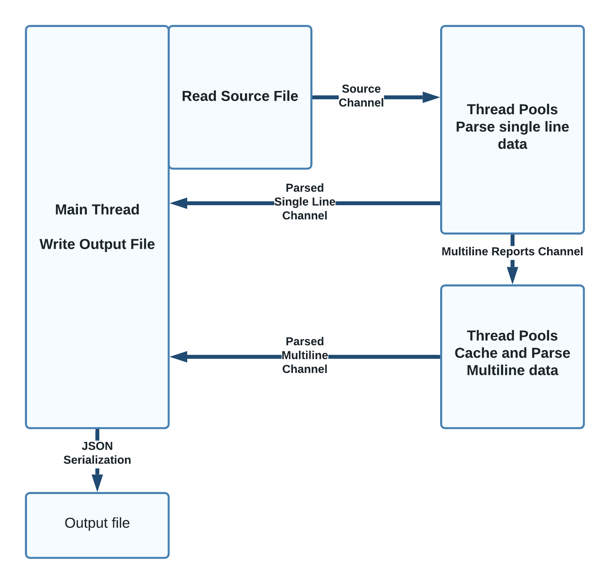

# DRAFT DRAFT DRAFT
# Data Engineering in Rust
It's the richness of the Python ecosystem that makes it so useful for  science.  Python provides a range of tools that provide accessible and expressive environments with which to explore data, train machine learning models and display results. It's even been suggested that _Jupyter Notebooks_, a popular Python data exploration environment, replace the traditional scientific paper[^atlantic].

[^atlantic]: https://www.theatlantic.com/science/archive/2018/04/the-scientific-paper-is-obsolete/556676/

But Python has issues- the very elements that make it accessible and usable- dynamic typing, reference counting and the global interpreter lock- prevent your programs from making full use of available computing resources.

For scientists working with large data or heavy computation, Python provides some work arounds- computational accelerations like Numba, PyPy and Piston use coding optimisations to add speed; distributing the compute across several machines with Dask aggregates the computing power of several machines;  and interfaces to big data  toolkits like PyData leverage the huge ecosystem built on Hadoop and friends. All of these solutions add complexity to development and deployment environments.

Near the end of 2020, the science publication _Nature_ suggested an alternative[^nature] to some of the traditional approaches to science data computation. It suggested Rust, an emerging, highly performant new language.

[^nature]: https://www.nature.com/articles/d41586-020-03382-2

The Rust language made its debut in 2009 as a side project of Mozilla programmer Graydon Hoare. It offers similar performance to C++, but provides better safeguards around memory safety and concurrency. Like C++ and Python, it can be used across a range of platforms, from microcontroller programming for data collection to high capacity asynchronous web application programming. Rust applications can be compiled to _web assembly_, allowing them to run in the browser at near-native speeds, or as highly performant Python extensions through the PyO3 project.

I was curious how Rust could help with a data engineering issue that emerges from the global monitoring of ships.

# Automatic Identity System

By international agreement, ocean going ships must transmit voyage data using the _Automatic Identity System[^ais]_ (AIS). These signals can be collected from space and aggregated into a global picture of maritime activity. The Canadian Space Agency manages Government of Canada contracts for space-sourced global maritime tracking data, and on any given day, makes millions of position reports available to maritime stakeholders across government. Over the past decade CSA has collected well over 50 billion AIS messages.

[^ais]: https://en.wikipedia.org/wiki/Automatic_identification_system

 The data is encoded in an opaque format codified by the National Marine Electronics Association (NMEA 0183/AIS).

```
1569890647\s:VENDOR,q:u,c:1569890555*5F\!AIVDM,1,1,,A,13KG9?10031jQUNRI72jM5?40>@<,0*5C
1569890647\s:VENDOR,q:u,c:1569890555*5F\!AIVDM,1,1,,B,13aEPIPP00PE33dMdJNaegw4R>@<,0*77
1569890647\g:1-2-6056,s:VENDOR,c:1569890555*3A\!AIVDM,2,1,6,A,56:GTg0!03408aHj221<QDr1UD4r3?F22222221A:`>966PW0:TBC`6R3mH8,0*0E
1569890647\g:2-2-6056*58\!AIVDM,2,2,6,A,88888888880,2*22
```

_A sample of ship positional data in NMEA 0183 format. The Government of Canada consumes up to 80 million of these messages in a day from various sources._

Each sentence contains metadata about the position report, including the time the observation was made by the sensor, the source of the detection, the time the report was relayed from satellite to a ground station and whether the sentence is a fragment of a group of messages. 

Although some of the message is human readable, important data about ship identity and movement is wrapped in a six-bit ASCII payload near the end of the sentence. Eric Raymond's AIVDM/AIVDO protocol decoding[^raymond] website is a detailed guide to how ship data is packed in the string.

[^raymond]: https://gpsd.gitlab.io/gpsd/AIVDM.html

## Decoding AIS
The goal of this program is to convert an archive of raw AIS data to a JSON equivalent.  The output should preserve the original data for reprocessing if needed, but also expose some of the data in the message for filtering on load.  Reformatting the data as JSON is a valuable step in the data engineering pipeline as it allows the datato be loaded in Pandas, a database, or further translated into a read optimized format like Apache Parquet or feather.

```
{
    "sentence":"1569888002\\s:VENDOR,q:u,c:1569884202*4F\\!AIVDM,1,1,,B,1:kJS6001UJgA`mV1sFrGHAP0@L;,0*56",
    "landfall_time":"1569888002",
    "group":"",
    "satellite_acquisition_time":"1569884202",
    "source":"VENDOR",
    "channel":"B",
    "raw_payload":"1:kJS6001UJgA`mV1sFrGHAP0@L;",
    "message_type":1,
    "message_class":"singleline",
    "mmsi":"725000984",
    "latitude":-45.385661666666664,
    "longitude":-73.55857,
    "call_sign":"CQ4F3",
    "destination":"HALIFAX",
    "name":"SS MINNOW",
    "ship_type":"23",
    "eta":"",
    "draught":"",
    "imo":"",
    "course_over_ground":"86950448",
    "position_accuracy":"0",
    "speed_over_ground":"101",
    "navigation_status":"0"
}
```

_The desired output: JSON packet preserving original data alongside derived elements._

REGEX is used to extract the human readable data in the AIS sentence, but work has to be done to unwrap the the data from the six-bit payload. Unlocking this data involves converting the payload to a binary number, carving out a subset of the bits and casting the result as a string, or an integer.


_Extracting data from the payload requires it to be converted to binary._

# Walking through the program
The program I wrote uses threads to distribute the workload over all available computer cores with message passing channels relaying the data between threads. The processing is divided into three pools: the first is a single threaded process that reads a source file of AIS data, inserts each line into a struct field, and passes the struct to a pool of threads that does the initial parsing through a channel.

The receiving thread parses the single line position messages, and forwards the results to a file writer as a JSON packet. Multiline sentences are passed to a second pool of threads that cache and reassemble sentence fragments. Again these results are forwarded to the file writer as a JSON string.



The following are some of the highlights of the program.

### Crates and version pinning

Rust makes use of a well thought out packaging system called _crates_. Package dependencies and build directives can be specified in this file.

```
[package]
name = "ais"
version = "0.1.0"
edition = "2021"

[dependencies]
crossbeam-channel = "0.5.2"
threadpool = "1.8.1"
num_cpus  = "1.13.1"
hashbrown = "0.12.0"
clap = "3.0.7"
regex = "1.5.4"
bitvec = "1.0.0"
serde = { version = "1.0.136", features = ["derive"] }
serde_json = "1.0.78"

[profile.release]
lto = true
```

Crate dependencies must be listed with a specific version; upgrading to a different release of the crate has to be done explicitly, mitigating errors from moving to different library versions.

### The iron fist of variable scoping
One of the methods Rust uses to maintain memory safety is to tightly control variable scope.

```
let x = 21;
{
    let x =12;
    }
println!("{}", x);
```

The code snippet above would print the number "21" because the assignment "x = 12" is only valid between the braces.

This is a powerful way to keep your memory in order, but it can be counter-intuitive. For example, the following doesn't work because the variable is descoped at the end of the brace pair.

```
if y == 1 {
    let x = 21;
} else {
    let x = 0;
}
println!("{}", x);

}
```

One way to deal with this is to create a anonymous function where the output of the function is assigned to the variable.  Variable assignments with nested _if_ and _match_ evaluations are used throughout the program.

```
let y = 1;
let x = 21;
let x: i8 ={
    if y == 1 {
         67
    }
    else {
        0
    }
};
    
println!("{}", x);
```

The rigid control of variable lifetimes and ownership changes the way you structure your program.

### Resistance is futile

The compiler is very chatty and will refuse to compile code that transgresses Rust's guard rails.

```
error[E0308]: mismatched types
 --> src/main.rs:8:10
  |
8 |          67.0
  |          ^^^^ expected `i8`, found floating-point number

For more information about this error, try `rustc --explain E0308`.
error: could not compile `playground` due to previous error
```

While sometimes frustrating, the compiler's messages are very helpful in determining the cause of the error.  The mantra "work with the compiler" is often seen in online comments.

The software begins by defining a struct that will hold the raw sentences and extracted data as it passes through the workflow.

```
#[derive(Serialize, Default, Clone, Debug)]
struct PositionReport {
    pub sentence: String,
    pub landfall_time: String,
    pub group: String,
    pub satellite_acquisition_time: String,
    pub source: String,
    pub channel: String,
    pub raw_payload: String,
    pub message_type: u64,
    pub message_class: String,
    pub mmsi: String,
    pub latitude: f64,
    pub longitude: f64,
    pub call_sign: String,
    pub destination: String,
    pub name: String,
    pub ship_type: String,
    pub eta: String,
    pub draught: String,
    pub imo: String,
    pub course_over_ground: String,
    pub position_accuracy: String,
    pub speed_over_ground: String,
    pub navigation_status: String,
} // end of struct PositionReport
```

Note the _#Derive_ keyword preceding the struct definition. Although Rust is not an object-oriented language like Java, it allows methods to be shared across structures using a feature called _Traits_ in a way that resembles inheritance.

In the declaration above, the Serialize, Default, Clone and Debug traits are being added the struct.

### Thread Pools

Defining thread pools is quite simple in Rust. The program finds the number of available cores and declares the number of workers for each thread.

For loops are used to launch individual threads.

```
    // Workers are the number of CPUs.
    let n_workers = num_cpus::get();

    let reading_thread = ThreadPool::new(1);
    let extraction_pool = ThreadPool::new(n_workers);
    let multiline_assembly_thread = ThreadPool::new(n_workers);

    for _a..n_workers: {
        multiline_assembly.execute(move || {
            // Do stuff
        }
    }

    for _b..n_workers: {
        extraction_pool.execute(move || {
            // Do stuff
        }
    }

    reading_thread.execute(move || {
        // Do stuff
    }
```
The _for_ loops control the number of threads launched, while the _move_ keyword passes the current variables to the thread.


### Channel Definitions and Flow Control
The relay channels between the threads are defined with a limit to prevent the producing threads from overfilling the channel and exhausting memory.  By default the program sets the upper bound to 500,000 elements, but it can be changed from the command line to best fit the available memory.

Each declaration defines a sending and receiving channel, and the data types that will be running across the message bus.

```
    let (raw_file_tx, raw_file_rx): (Sender<PositionReport>, Receiver<PositionReport>) = bounded(flow_limit);
    let (multiline_handling_tx, multiline_handling_rx): ( Sender<PositionReport>, Receiver<PositionReport>) = bounded(flow_limit);
    let (ready_for_output_tx, ready_for_output_rx): (Sender<String>, Receiver<String>) =
        bounded(flow_limit);
```
Because of Rust's rules on variable reuse, the channel data type has to be _cloned_ in each thread, but each clone actually refers to the original instance of the message bus.

```
     extraction_pool.execute(move || {
        let raw_file_rx = raw_file_rx.clone().clone();
        let extract_ready_for_output_tx = extract_ready_for_output_tx.clone();
        let multiline_handling_tx = multiline_handling_tx.clone();
     }
```

### Matching messages
AIS message types determine how ship information is stored in the six-bit payload, so any parsing task has to begin with carving out the type of the current sentence and casting it as an unsigned INT in the appropriate struct field.

```
line.message_type = pick_u64(&payload, 0, 6);
```

From there, the message type can be matched against parsing templates and other fields in the struct populated.

```
 match line.message_type {
        1 | 2 | 3 => {
            // If the message is class A kinetic.
            line.mmsi = format!("{}", pick_u64(&payload, 8, 30));
            line.latitude = pick_i64(&payload, 89, 27) as f64 / 600_000.0;
            line.longitude = pick_i64(&payload, 61, 28) as f64 / 600_000.0;
            ...
        }
        5 => {
            // If the message is class A static.
            line.mmsi = format!("{}", pick_u64(&payload, 8, 30));
            line.call_sign = pick_string(&payload, 70, 42);
            line.name = pick_string(&payload, 112, 120);
            ...
        }

```

### Arc Mutexes and Hash maps
Assembling multiline messages in multiple threads requires caching sentence fragments in a shareable way.  This program uses a shared hash-map wrapped in a mutex to hold sentence fragments. 
```
    // Initiate Hashmaps for multisentence AIS messages
    // These are wrapped by ARC and Mutexes for use under multithreading.
    let mut payload_cache: Arc<Mutex<HashMap<String, String>>> =
        Arc::new(Mutex::new(HashMap::new()));
    let mut source_cache: Arc<Mutex<HashMap<String, String>>> =
        Arc::new(Mutex::new(HashMap::new()));
    let mut sat_time_cache: Arc<Mutex<HashMap<String, String>>> =
        Arc::new(Mutex::new(HashMap::new()));
```
Like the interprocess channels, the hash maps must be cloned in each thread instance.

```
    // Initiate Hashmaps for multisentence AIS messages
    let payload_cache = Arc::clone(&mut payload_cache);
    let source_cache = Arc::clone(&mut source_cache);
    let sat_time_cache = Arc::clone(&mut sat_time_cache);
```
Each hash map needs a lock defined in each thread to deconflict the reads and deletes from multiple threads.

```
    let mut payload_lock = payload_cache.lock().unwrap();
    let mut source_lock = source_cache.lock().unwrap();
    let mut sat_time_lock = sat_time_cache.lock().unwrap();

    // insert into time cache if struct field is not empty
    if line.satellite_acquisition_time.len() > 0 {
        sat_time_lock.insert(line.group.clone(), line.satellite_acquisition_time);
        }
```
### JSON serialization
The SERDE crate offers a convenient way to serialize a struct to a JSON string.  At the end of the parsing cycle, each thread converts the populated struct to JSON for writing to file.

```
    ready_for_output_tx.send(serde_json::to_string(&line).unwrap());

```

The output of the program can be loaded in Pandas with the following command.
```
import pandas as pd
df=pd.read_json("output.json", lines=True)
```
## Running the program
Executing the program without parameters will output the following.
```
error: The following required arguments were not provided:
    <INPUT>
    <OUTPUT>

USAGE:
    rustaise <INPUT> <OUTPUT> [FLOW_LIMIT]

For more information try --help
```

With the _--help_ flag.
```
AIS parsing program 1.0
Scott Syms <ezrapound1967@gmail.com>
Does selective parsing of a raw AIS stream

USAGE:
    rustaise <INPUT> <OUTPUT> [ARGS]

ARGS:
    <INPUT>                Sets the input file to use
    <OUTPUT>               Sets a custom output file
    <FLOW_LIMIT>           Sets a limit on the number of objects in memory at one time (default:
                           500000)
    <PARSE_THREADS>        Sets the number of threads to use for parsing (default: number of
                           CPUs)
    <MULTILINE_THREADS>    Sets the number of threads to use for multiline parsing (default:
                           number of CPUs)

OPTIONS:
    -h, --help       Print help information
    -V, --version    Print version information


```

Uncompressing the _norway.7z_ program and running the following will generate a JSON file with parsed contents.
```
rustaise norway.nmea norway.json
```
the _FLOW LIMIT_ parameter allows you to limit the the data held in the message channels.  In some memory constrained systems, capping in-flight messages prevents out of memory issues.  The _PARSE THREADS_ and _MULTILINE THREADS_ are optional parameters that provide control over the number of threads created for the single and multiple line parsing threads.


### Speed results
Rust lives up to its advertising as a _blazingly_ fast language.

All results are from running Macbook 2.3 GHz 8-Core Intel Core i9 with 32Gb of memory.  In the timings table below, the row indicates the size of the input file.  The first column shows the processing time required and the final column forecasts how much data could be processed in a day at the sample rate.

| Sample size|default|5,000|1,000,000|5,000,000|9,000,000| estimate per day (default)|
|------------|------:|----:|--------:|--------:|--------:|-----------------:|
| 1 million | 7s |12,342,857,142|
| 25 million | 65s |33,230,769,230 |
| 174 million | 34,560,000,000|

These figures suggest that the software would be able to process a 50 billion row AIS archive in just under two days on a single laptop.

### Last Thoughts
This is my first attempt to do some serious programming in Rust, but even from this vantage point, I'm able to see room for improvement.  

Being new to the language, I know that my approach to the solution may not be idiomatic, ie/ making the best use of what Rust offers to solve the problem, but I'm pleased with my progress on a first attempt.

The program largely ignores Rust's error handling framework.  Initializing the struct with default values may unnecessarily consume memory. Leveraging struct methods and custom traits may offer some advantages. 

Definitely refactoring the code into Rust's library and module format would be a step toward code readability.  Finally, Rust offers unit-testing framework that would make the code more maintainable.

Generally, the juice is worth the squeeze here. Rust works as advertised and the effort in learning the language would be paid back in situations where the code will be reused or execution time is a concern.

### Getting the code
All code is available at https://github.com/ScottSyms/RustAISe.

Please feel free to use it and I'd appreciate any feedback you might have.

## Licenses
The software is made available under an Apache 2.0 license.

The archive includes a 7zip compressed sample of AIS data from the government of Norway.  It's made available under the Norwegian Licence for Open Government Data (NLOD) 2.0[^norway].

[^norway]: https://www.kystverket.no/en/navigation-and-monitoring/ais/access-to-ais-data/

Some of the bitvec manipulation code is taken from Timo Saarinen's _nmea-parser_ package[^timo] which is provided under an Apache 2.0 license.
[^timo]: https://github.com/zaari/nmea-parser 
